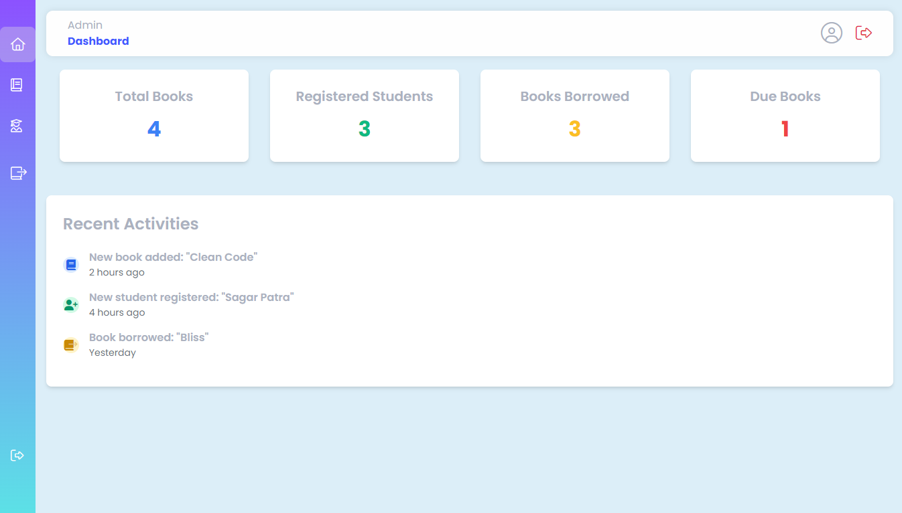

# 📚📖 Library Management System

---

## 🌟✨ Overview

The **📚 Library Management System** is a 🌐 web-based application designed to streamline 📘 library operations. It helps manage 📖 books, 🙋 users, and administrative tasks efficiently, providing an intuitive interface for both 🔧 admins and 📚 library users.

---

## 🛠🔧 Features

- 🔒 **Secure Authentication**: Login and registration system for 🙋 users and 🔧 admins.
- 📖 **Book Management**: ➕ Add, ✏️ edit, ❌ delete, and 🔍 search for 📚 books in the catalog.
- 🧑‍💻 **Admin Dashboard**: Manage 📚 library operations and 🙋 users.
- 📊 **Responsive Design**: User-friendly interface that works on 📱 all devices.
- 💿 **SQL Database Integration**: Reliable data storage for all 📚 library records.

---

## ⚙️🛠 Technology Stack

- **🖼 Frontend**:

  - 🌐 HTML5, 🎨 CSS3 (with ✨ Tailwind CSS for styling)
  - 🖱️ JavaScript

- **🔒 Backend**:

  - 🐘 PHP

- **💾 Database**:

  - 🐬 MySQL

---

## 💂‍♂️📂 Project Structure

```
├── 🗂️ admin/                # Admin functionalities 
│   ├── ➕ add-books.php       # Add 📚 books functionality
│   ├── ➕ add-student.php     # Add 🙋 student functionality
│   ├── 🖥 dashboard.php       # Admin dashboard
│   ├── ❌ delete-book.php     # Delete 📚 book functionality
│   ├── 📥 issue-book.php      # Issue 📚 books functionality
│   ├── 🖼 layout.php          # Layout structure
│   ├── 🔒 logout.php          # Logout functionality
│   ├── 📚 manage-books.php    # Manage 📚 books functionality
│   ├── 📑 manage-issue-books.php # Manage issued 📚 books functionality
│   ├── 🧑‍🎓 student.php         # Manage 🙋 students functionality
│   └── 🎨 style.css           # Admin-specific styling
├── 🖼 images/               # 📷 Images used in the application
│   ├── 🌅 BGIS.png            # 🌌 Background image for the interface
│   ├── ℹ️ about.png           # ℹ️ About page image
│   └── 📞 contact.png         # 📞 Contact page image
├── 🗂️ server/               # Server-side configurations
│   └── 🔗 connect.php         # Database connection file
├── ℹ️ about-us.php          # ℹ️ About Us page
├── 📞 contact.php           # 📞 Contact page
├── 🖥 default.php           # Default template file
├── 🖼 layout.html           # HTML layout structure
├── 🔒 login.php             # 🙋 User/🔧 Admin login
├── 🖱️ script.js             # 🖱️ JavaScript logic
├── 🎨 style.css             # 🎨 CSS for styling
```

---

## 🚀✨ Installation

### 🛠 Prerequisites

- **🐘 PHP**: Version 7.4 or later.
- **🐬 MySQL**: For 💾 database management.
- **🌐 Web Server**: 🖥 Apache or any compatible server (e.g., 🐘 XAMPP).

### 🔧 Steps

1. 🌀 Clone the repository:

   ```bash
   git clone https://github.com/yourusername/Library-Management-System.git
   ```

2. 🗂️ Navigate to the project folder:

   ```bash
   cd Library-Management-System
   ```

3. 📥 Import the 💾 database:

   - Open **🌐 phpMyAdmin**.
   - ➕ Create a new database (e.g., `library_db`).
   - 📥 Import the `library_db.sql` file located in the `/db` folder.

4. 🔗 Configure the 💾 database connection:

   - ✏️ Update the database credentials in `server/connect.php`.

5. 🖥 Start the server:

   - Run your local server (e.g., 🐘 XAMPP, 🐘 MAMP, 🐘 WAMP).
   - Access the project at `http://localhost/Library-Management-System`.

---

## 🌟📷 Screenshots 

### 🏠 Home Page


### 🖥 Admin Dashboard

---

## 👨‍💻🤝 Contributing

Contributions are ❤️ welcome! To contribute:

1. 🍴 Fork the repository.
2. ➕ Create a 🌱 feature branch:
   ```bash
   git checkout -b feature-name
   ```
3. 📝 Commit your changes:
   ```bash
   git commit -m "Add your message here"
   ```
4. 📤 Push to the branch:
   ```bash
   git push origin feature-name
   ```
5. 📨 Open a Pull Request.

---

## 🖍️📜 License

This project is licensed under the **⚖️ MIT License**. Feel free to use and ✏️ modify it as needed.

---

## 🙌🙏 Acknowledgments

- **🐘 PHP.net** for 📄 documentation.
- **✨ Tailwind CSS** for providing an amazing 🎨 styling framework.

---

## 📧📞 Contact

**Roni Sarkar**\
📍 🌏 West Bengal, India\
📧 Email: [your-email@example.com](mailto:your-email@example.com)\
🌐 Website: [YourWebsite.com](https://yourwebsite.com)

